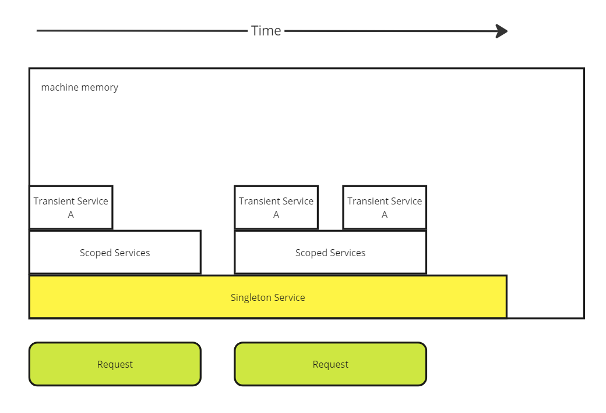

# Dependency Injection


# Talking points
- Transient, scoped and singleton memory demo
- How to register things 
- Longer term maintnenace solutions

## A land before time

Back in the old days when unit testing was not priorty and dependency injection required third party libraries we had the following.

```c#
public class Service{

    ConcreteService _cs1; 
    ConcreteService2 _cs2;

    public Service() {
        // New these up internally
        _cs1 = new();
        _cs2 = new();
        ...
    }
}

public class ConsumerService {
    Service _s;

    public ConsumerService() {
        _s = new Service();
    }
}
```

If you were working in the Winforms/Wpf good-ol-days you'd be lucky if there was some form of MVVM (Model, View, ViewModel) structures put in to reduce file sizes and manage the domain. The real question is, why would you overcomplicate something that's always going to have 1 concrete implementation anyway?

## Back in the old days

Who remembers these?

- [Ninject](https://github.com/ninject/Ninject)
- [Autofaq](https://autofac.org/)

This was how things were done before dependency injection was mainstream. DI was introduced in 2016 with ASP.NET core 1.0! It's not too different to the way it's done now. 

Older 4.5/4.5 net projects will still be using these. The grey hairs will know it.

## Lifecycle in an application


### Singletons
Data is persistent per application instance. Can not have references to other scopes besides Singletons. If you have multiple instances of the webapp running, they will not share the same internal memory. A useful way to think about it is an in-memory cache.

### Scoped
Data is persistent per invocation and all instances of this class are shared. It will clean itself up at the end of the request. Can reference both Singleton and Transient classes

### Transient
The most volitile. Consider this to be a simple function. Useful for functional programming. Each class referencing this class will be unique.

**Demo with the C# in this project**

## Why is it?
### Moq and the stubbing out pattern.
Here is where Java is actually superior. Most cases, everything is an object and everything is extendable. You can make your own version of the class to return whatever you want. 

**Demo with the test project**

## All the things


You can basically inject anything.


## More injection

[Decorators](https://en.wikipedia.org/wiki/Decorator_pattern) - Don't worry about it, I got chu fam.

We will be using [Scrutor](https://github.com/khellang/Scrutor) for more complicated injections as the vanilla does not support this.
